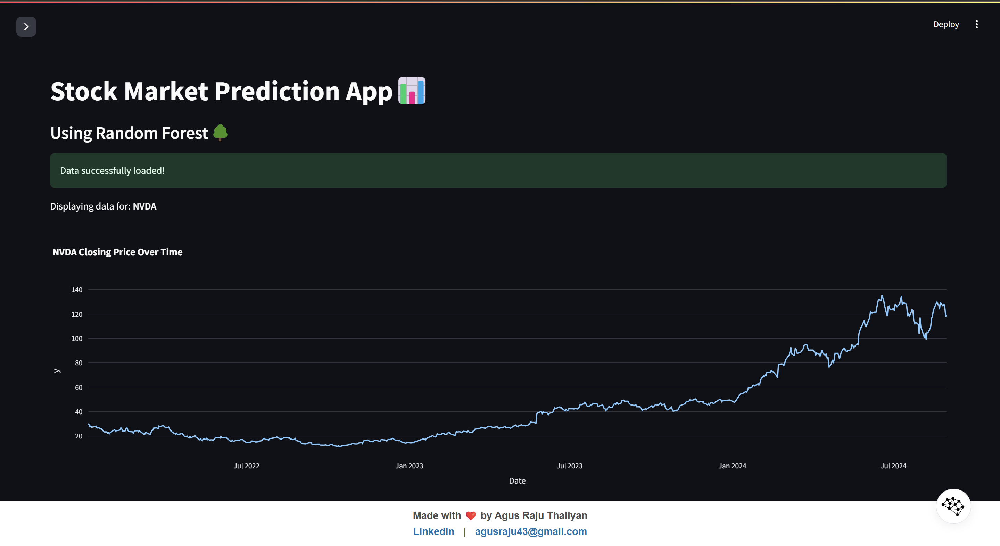
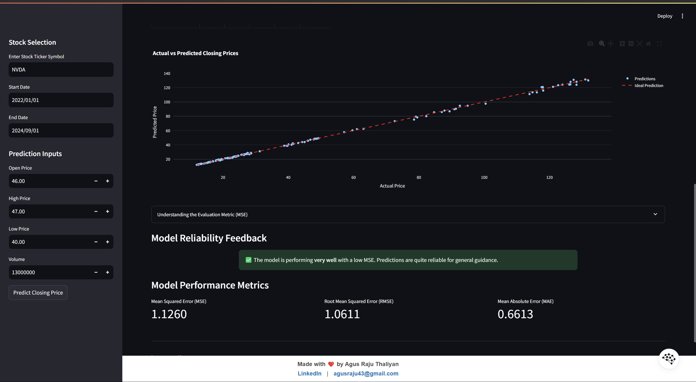

# Stock Market Prediction App🚀
 
 This Streamlit app uses an **XGBoost (Extreme Gradient Boosting)** model to forecast future stock prices based on historical data. The model uses advanced features like **Seasonality** (Day/Month/Year), **Lagged Prices**, and **Rolling Statistics**.
 
 ## Home Interface
 
 
 ## Actual v/s Prediction Values
 
 ## Features
 
 - Fetch and display historical stock data
 - Train an XGBoost model with Seasonality & Lags for accurate forecasting
 - Visualize stock price trends and future forecasts (7-90 days)
 - "Premium" UI/UX Design
 
 ## Installation
 
 1. Clone this repository:
    ```
    git clone https://github.com/agusrajuthaliyan/Stock-Price-Prediction-App.git
    ```
 
 2. Install the required packages:
    ```
    pip install -r requirements.txt
    ```
 
 ## Usage
 
 Run the Streamlit app:
 ```
 streamlit run main.py
 ```
 
 Navigate to the provided local URL in your web browser to use the app.